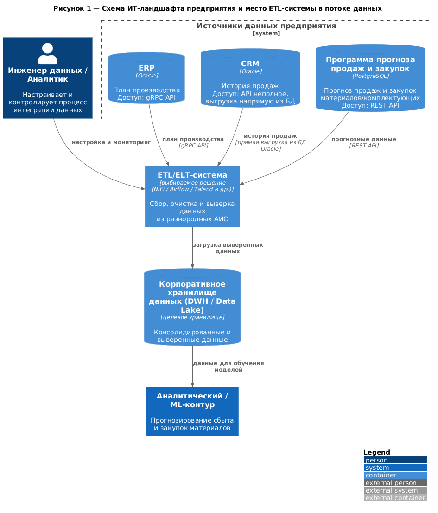
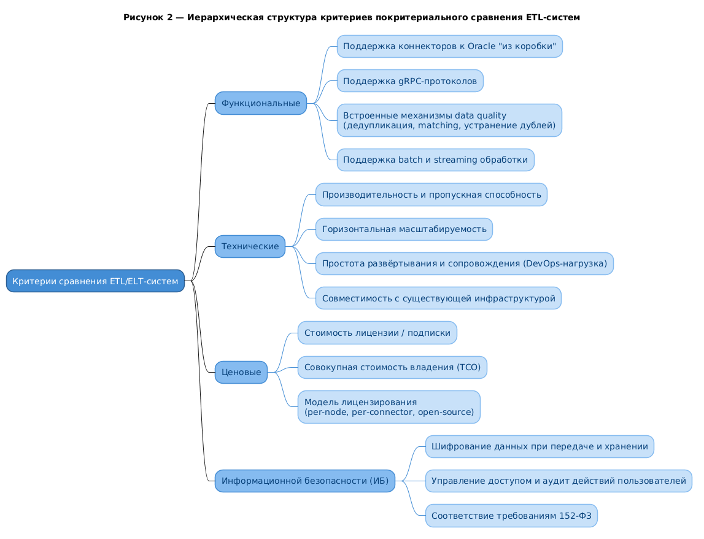

# Методические указания к выполнению лабораторной работы №4

## «Проектирование Data Lake для IoT-данных с использованием облачных PaaS-сервисов»

| Параметр | Значение |
|---|---|
| Блок курса | Модуль 10. Облачные инструменты построения ETL/ELT-конвейеров и КХД (Data Lake, облачные PaaS) |
| Трудоёмкость | 10 академических часов |
| Формируемая компетенция / индикатор | BD-5, BD-4 / BD-5.1, BD-4.3 |
| Уровень сложности | Продвинутый (П) |

> **Расшифровка индикаторов** (источник: "КРМ-версия3.0.xlsx", лист «Роли-компетенции наглядно», блок «Работа с данными»):
> **BD-5** — компетенция, связанная с проектированием и эксплуатацией распределённых систем хранения данных (Data Lake, облачные платформы хранения и обработки). **BD-5.1** — под-индикатор, раскрывающий способность проектировать многозонную архитектуру Data Lake (зоны Raw/Curated/Consumption) с учётом требований последующей ML-обработки, включая выбор облачных PaaS-сервисов для приёма, хранения и предобработки потоковых данных.
>
> **BD-4** — «Обработка больших данных». Формулировка компетенции: «Способен применять различные модели и (или) технологии обработки больших данных». **BD-4.3** — под-индикатор, связанный с проектированием архитектурного описания системы обработки больших данных (в дополнение к BD-4.1 — выбору технологий обработки, и BD-4.2 — сбору и выверке данных из источников), реализуемый в данной работе через построение диаграмм уровня Context и Container в нотации C4.
>
> **Связанные профессиональные роли** (источник: "Роли.xlsx", лист «Инструментальные компетенции», направление «Обработка больших данных»):
> **Data Engineer (Инженер по данным)** и **Data Architect (Архитектор данных)** — обе роли непосредственно связаны с проектированием Data Lake и выбором технологий хранения и обработки данных. По "Роли.xlsx", уровень освоения по направлению «Обработка больших данных» для роли Data Engineer обозначен как **Э (экспертный)**, для Data Architect — **П (продвинутый)**; для смежной роли **MLOps** — **П (продвинутый)**, для **Data Analyst** — **Б (базовый)**.
>
> Шкала уровней (по обоим источникам): Б — базовый, С — средний, П — продвинутый, Э — экспертный, «+» — вспомогательная компетенция, «-» — компетенция не применяется к данной роли.

## 1. Цель работы

Целью лабораторной работы является формирование у студента навыков разработки верхнеуровневого проекта Data Lake для сбора и хранения IoT-данных с применением облачных PaaS-сервисов, а также освоение методов архитектурного описания решения с использованием нотации C4.

По итогам выполнения работы студент должен уметь:

1. Формулировать техническое задание на проектирование Data Lake для потоковых IoT-данных.
2. Выбирать и обосновывать состав облачных PaaS-сервисов для сбора, хранения и предобработки данных.
3. Строить архитектурные диаграммы уровня Context и Container в нотации C4.
4. Проектировать многозонную структуру Data Lake (Raw/Curated/Consumption) с учётом требований последующей ML-обработки.
5. Учитывать требования по неиспользованию персональных и конфиденциальных данных при проектировании архитектуры.

## 2. Бизнес-контекст и входные данные

Заказчик — промышленное предприятие, эксплуатирующее сеть IoT-датчиков (температура, давление, вибрация, расход и т.п.). Данные с датчиков собираются отдельным сервером и затем с использованием облачных PaaS-сервисов размещаются в Data Lake для последующей ML-обработки (построение моделей предиктивного обслуживания, выявление аномалий и т.п.).

**Задание: выбрать облачные сервисы Data Lake и спроектировать архитектуру системы.**

*Важное ограничение проекта: персональные и конфиденциальные данные системой не собираются и не обрабатываются — весь поток данных состоит исключительно из технических показаний датчиков. Это ограничение должно быть явно отражено в ТЗ и учтено при выборе сервисов (например, требования по защите персональных данных, такие как соответствие 152-ФЗ, для данной системы не применяются в базовом контуре, однако общие требования ИБ к промышленным данным сохраняются).*

Важное разъяснение формата выполнения работы: лабораторная предполагает верхнеуровневое архитектурное проектирование, а не обязательное промышленное развёртывание системы. Проверка архитектуры допускается в двух вариантах, выбор которых обсуждается с преподавателем на этапе 1:

1. **Вариант А (базовый, обязательный)** — проектирование архитектуры «на бумаге»: диаграммы C4, обоснование стека, без реального создания облачных ресурсов. Подходит, если нет доступа к платному облачному аккаунту.
2. **Вариант Б (дополнительный, по желанию)** — минимальный PoC: разворачивается 1–2 сервиса из выбранного стека в рамках бесплатного грант-периода (например, у Yandex Cloud стартовый грант для физических лиц составляет до 4000 рублей на 60 дней), через них пропускается тестовый поток из 10–20 синтетических сообщений, результат прикладывается в виде скриншотов консоли и логов. PoC учитывается в критериях «качество артефакта» и «обоснованность» в рамках **тех же 10 баллов** БРС (не сверх лимита).

Если выбран Вариант А, все компоненты архитектуры на диаграммах Container должны сопровождаться указанием, что они не развёрнуты физически, а являются проектным решением. Это разграничение обязательно явно зафиксировать в разделе описания архитектуры отчёта.

### 2.1. Исходные данные и допущения

1. Источник данных — сеть IoT-датчиков, подключённых к промежуточному серверу сбора (edge-агрегатору).
2. Формат передачи — потоковая телеметрия (например, MQTT/AMQP) с сервера сбора в облако.
3. Объём данных — большой поток измерений с высокой частотой опроса (секунды/минуты), что требует масштабируемого хранения.
4. Потребитель данных — ML-платформа, выполняющая последующую обработку (обучение моделей, инференс).
5. Облачная платформа — выбирается студентом самостоятельно (см. этап 2) из числа доступных провайдеров (Yandex Cloud, VK Cloud, SberCloud, AWS, Azure, GCP — с учётом актуальной доступности на территории РФ).

## 3. Порядок выполнения работы

Работа выполняется в два этапа. Каждый этап завершается обсуждением результата с преподавателем перед переходом к следующему шагу.

### Этап 1. Составление технического задания (ТЗ)

На этом этапе необходимо перевести общее описание задачи (раздел 2) в конкретные технические формулировки, достаточные для проектирования архитектуры на этапе 2.

#### 3.1.1. Определите характеристики входного потока данных

Зафиксируйте в ТЗ количественные и качественные параметры потока телеметрии:

1. Количество и типы датчиков (например, 500 датчиков 4 типов: температура, давление, вибрация, расход).
2. Частота передачи показаний (например, раз в 10 секунд с каждого датчика).
3. Формат сообщений (например, JSON с полями: device_id, timestamp, metric_type, value).
4. Ориентировочный суточный объём данных и ожидаемый рост нагрузки при масштабировании сети датчиков.

#### 3.1.2. Сформулируйте пользовательские сценарии использования Data Lake, разработайте диаграмму уровня Context С4

Опишите 2–3 сценария того, как ML-платформа и инженеры данных будут использовать Data Lake, например:

1. «ML-модель предиктивного обслуживания раз в сутки читает агрегированные показания за последние 30 дней из слоя Consumption для переобучения».
2. «Инженер данных выполняет разовый анализ аномалий по историческим данным за конкретный период из слоя Raw».
3. «Сервис детекции аномалий в режиме, близком к реальному времени, подписывается на поток обработанных событий из слоя Curated».

Разработайте диаграмму уровня Context С4. Сформулируйте требования к каждому функциональному компоненту системы. Диаграмма Context показывает систему как единый блок или набор функциональных блоков и её взаимодействие с внешними акторами и системами: датчиками, сервером сбора данных, ML-платформой и инженером данных. Описание моделей С4 приведено на сайте https://c4model.com/

*При построении собственной диаграммы отразите все внешние сущности, зафиксированные в ТЗ, при необходимости разбейте разрабатываемую систему на функциональные модули. Убедитесь, что стрелки отражают реальное направление потоков данных (от датчиков — к хранилищу, от хранилища — к ML-платформе).*

#### 3.1.3. Зафиксируйте требования по безопасности и нефункциональные требования

Явно укажите в ТЗ следующее ограничение и вытекающие из него требования:

1. Система не собирает и не обрабатывает персональные и конфиденциальные данные — весь поток состоит из технических показаний датчиков без привязки к физическим лицам.
2. Тем не менее данные являются коммерчески значимыми (технологические параметры производства) и требуют базовой защиты — контроль доступа, шифрование при передаче.
3. Требуемая доступность системы сбора данных (например, 99,5%).
4. Требуемое время задержки (latency) между поступлением показания и его доступностью для ML-обработки (например, не более 5 минут для слоя Curated).

*Числовые значения NFR (доступность, задержка) нельзя указывать произвольно — их нужно обосновать исходя из назначения данных. Используйте следующую логику обоснования:*

- **Доступность** (например, 99,5%) обосновывается через допустимое время простоя в месяц: 99,5% означает не более \(\approx\) 3,6 часов простоя в месяц [1] — это приемлемо для системы мониторинга, где кратковременный простой не приводит к потере критичных данных (данные будут переданы повторно после восстановления связи), но неприемлемо для систем безопасности реального времени (там нужно 99,9%+).
- **Задержка (latency)** обосновывается через частоту принятия решений на основе данных: если ML-модель предиктивного обслуживания переобучается раз в сутки (см. сценарий из п. 3.1.2), задержка доступности данных в 5 минут более чем достаточна; если бы стояла задача детекции аномалий в реальном времени для аварийной остановки оборудования, требовалась бы задержка в секундах, а не в минутах.

*В отчёте по каждому числовому значению NFR должно быть явно указано: «выбрано значение X, потому что оно вытекает из сценария использования Y (раздел 3.1.2)».*

*Результат этапа 1: документ ТЗ (по ГОСТ 34 серии), включающий характеристики потока данных, пользовательские сценарии и нефункциональные требования, включая явное указание на отсутствие персональных/конфиденциальных данных в системе. Обсудите ТЗ с преподавателем до перехода к этапу 2.*

### Этап 2. Проект архитектуры решения (диаграммы C4), выбор технологий

На этом этапе разрабатывается верхнеуровневая архитектура системы сбора и хранения IoT-данных с использованием нотации C4 (уровень Container), а также выбирается и обосновывается конкретный набор облачных PaaS-сервисов.

#### 3.2.1. Диаграмма уровня Container

Диаграмма Container раскрывает внутреннее устройство системы через укрупнённые блоки — облачные PaaS-сервисы, обеспечивающие приём, обработку и хранение потока данных. Типовой набор контейнеров для Data Lake IoT-данных включает:

1. Сервис приёма потока (managed IoT Hub / managed Message Queue) — принимает телеметрию от сервера сбора данных.
2. Сервис потоковой обработки (managed Stream Processing) — выполняет первичную фильтрацию, агрегацию, обогащение данных.
3. Объектное хранилище слоя Raw — хранит необработанные данные «как есть».
4. Объектное/табличное хранилище слоя Curated — хранит очищенные, структурированные данные.
5. Хранилище/витрина слоя Consumption — хранит агрегаты и признаки (features), готовые для потребления ML-моделями.
6. Managed ETL/ELT-сервис — выполняет трансформацию данных между слоями.
7. Каталог метаданных (Data Catalog) — обеспечивает поиск и описание доступных наборов данных.

*Рисунок (к построению студентом): диаграмма контейнеров (C4: Container) архитектуры Data Lake для IoT-данных.*

*Рисунок 1 — Диаграмма контейнеров (C4: Container) архитектуры Data Lake для IoT-данных.*

#### 3.2.2. Многозонная структура Data Lake

Спроектируйте детальную структуру хранения по зонам (Raw / Curated / Consumption), определив для каждой зоны формат хранения, принцип партиционирования и правила доступа. Пример структуры приведён на рисунке 2.

*Рисунок (к построению студентом): многозонная модель Data Lake (Raw / Curated / Consumption).*

*Рисунок 2 — Многозонная модель Data Lake (Raw / Curated / Consumption).*

*Для своего варианта укажите конкретные форматы (например, JSON в Raw, Parquet в Curated), принцип партиционирования (по времени, по типу датчика) и то, какие метаданные будут регистрироваться в каталоге метаданных для каждой зоны.*

#### 3.2.3. Выбор и обоснование облачных сервисов

Выберите конкретную облачную платформу и для каждого контейнера архитектуры (см. 3.2.1) укажите конкретный PaaS-сервис. Обоснуйте выбор. Дополните обоснование стека оценкой примерной стоимости эксплуатации в месяц. Это не требует реального биллинга — используйте официальные калькуляторы облачных провайдеров (например, AWS Pricing Calculator, калькулятор Yandex Cloud) и параметры потока данных из ТЗ (этап 1, раздел 3.1.1).

Пример расчёта для потока из 500 датчиков, передающих показания раз в 10 секунд (\(\approx\) 4,3 млн сообщений/сутки):

| Компонент | Примерный объём в месяц | Ориентировочная стоимость |
|---|---|---|
| Приём потока (Managed IoT Hub/Message Queue) | \(\approx\) 130 млн сообщений | зависит от тарифа провайдера за 1М сообщений |
| Хранилище Raw (Object Storage) | \(\approx\) 50–100 ГБ (в зависимости от размера сообщения) | низкая стоимость за ГБ/месяц у объектного хранилища |
| Хранилище Curated/Consumption | в 3–5 раз меньше Raw за счёт агрегации | стоимость сопоставима с Raw за ГБ |
| Managed Stream Processing | зависит от выбранной конфигурации вычислительных ресурсов | обычно основная статья расходов в архитектуре |

*Таблица приведена как пример — названия сервисов необходимо заменить на актуальные для выбранной вами облачной платформы и обосновать выбор собственными аргументами.*

Точные цифры зависят от выбранного провайдера и тарифного плана на момент выполнения работы — приведите ссылку на использованный калькулятор и скриншот расчёта в приложении к отчёту. Если работа выполняется в рамках Варианта А (без реального биллинга), достаточно оценочного расчёта по официальным опубликованным тарифам без создания платёжного аккаунта.

*Результат этапа 2: диаграммы Context и Container, схема многозонной структуры Data Lake, таблица выбранного технологического стека с обоснованием, текстовое описание архитектуры (1–1,5 страницы). Обсудите итоговую архитектуру с преподавателем.*

## 4. Связь с ИИ-компонентой курса

В результате выполнения лабораторной работы разрабатывается архитектура системы сбора данных для последующей ML-обработки. В архитектуре используются PaaS-сервисы облачных платформ, обеспечивающие приём потока телеметрии, её структурирование по зонам Data Lake и подготовку признаков (features), необходимых для обучения и инференса моделей предиктивного обслуживания и детекции аномалий.

## 5. Требования к отчёту

Отчёт по лабораторной работе должен содержать следующие разделы:

1. Титульный лист (ФИО студента, группа, номер и тема лабораторной работы).
2. Техническое задание, включая характеристики потока данных и нефункциональные требования (результат этапа 1).
3. Диаграммы C4 Container с пояснениями (результат этапа 2).
4. Схему многозонной структуры Data Lake с описанием форматов хранения по зонам.
5. Таблицу выбранного технологического стека с обоснованием выбора каждого сервиса.
6. Оценку примерной стоимости эксплуатации решения в месяц с указанием использованного калькулятора и явным указанием выбранного варианта выполнения (А — проектирование без развёртывания, или Б — с PoC).
7. Краткие выводы по работе (0,5 страницы).

*Отчёт оформляется в электронном виде (DOCX или PDF), шрифт Times New Roman 14 пт.*

## 6. Критерии оценки

Оценка за лабораторную — **до 10 баллов** в [балльно-рейтинговой системе](../../../docs/points-rating-system.md). Ниже — детализация по содержанию работы (сумма **10**). Сводная таблица по всем ЛР — в [assessment-criteria.md](../../assessment-criteria.md).

| Критерий | Описание | Баллы (max) |
|---|---|---:|
| Полнота и корректность ТЗ | Учтены характеристики потока данных, сценарии; отсутствие персональных данных зафиксировано | 1 |
| Корректность диаграммы Context (C4) | Верно отражены внешние акторы и системы, направления потоков логичны | 2 |
| Корректность диаграммы Container (C4) | Полнота и связность контейнеров (приём, обработка, хранение по зонам) | 2 |
| Корректность многозонной структуры Data Lake | Обоснованы форматы хранения и партиционирование Raw / Curated / Consumption | 2 |
| Обоснованность выбора технологического стека | Критерии выбора PaaS-сервисов, сравнение обосновано | 1 |
| Защита | Самостоятельные ответы на вопросы по архитектуре и зонам | 2 |
| **Итого** |  | **10** |

Вариант Б (PoC) не добавляет баллов сверх **10**: учитывается внутри критериев артефакта и обоснованности. Соответствие общей рубрике БРС: ТЗ → «полнота ТЗ»; C4 и зоны → «качество артефакта»; стек → «обоснованность»; защита → «защита».

## 7. Контрольные вопросы

1. Что такое Data Lake и в чём его отличие от классического хранилища данных (Data Warehouse)?
2. Зачем в архитектуре Data Lake выделяют зоны Raw, Curated и Consumption? Какие задачи решает каждая зона?
3. Что такое PaaS-сервисы облачных платформ и в чём их преимущество перед самостоятельным развёртыванием инфраструктуры (IaaS) для задачи сбора IoT-данных?
4. Какие уровни детализации предусмотрены в нотации C4? В чём различие между уровнями Context и Container?
5. Почему в данном проекте система не должна собирать и обрабатывать персональные данные? Какие требования это снимает и какие требования ИБ всё же остаются?
6. Какие критерии следует использовать при выборе конкретного облачного сервиса для приёма потоковых данных с IoT-датчиков?
7. Как многозонная структура Data Lake влияет на качество и скорость подготовки данных для последующей ML-обработки?

## 8. Рекомендуемые инструменты и литература

### 8.1. Инструменты

1. Построение диаграмм C4 — draw.io, Structurizr, PlantUML (C4-PlantUML), Miro.
2. Облачные платформы для изучения PaaS-сервисов Data Lake — Yandex Cloud, VK Cloud, SberCloud (с учётом актуальной доступности на территории РФ).
3. Форматы хранения — Apache Parquet, ORC; каталогизация — Data Catalog / Glue Catalog (аналоги).

### 8.2. Литература

1. ГОСТ Р 71476-2024. Искусственный интеллект. Термины и определения.
2. Hadoop, SPARK, Hive. Учебное пособие. — 2024. URL: https://skills.a-ai.ru/storage/21/Hadoop,-SPARK,-Hive.pdf
3. Brown, S. The C4 model for visualising software architecture. URL: https://c4model.com
4. Data Lake Architecture. Обзор архитектурных практик. — 2023.
5. Материалы курса «Big Data» (блоки BD-5, BD-6) — "КРМ-версия3.0.xlsx" (Комплексная рабочая матрица компетенций, версия 3.0).
6. Матрица уровней освоения компетенций по профессиональным ролям — "Роли.xlsx" (роли Data Engineer, Data Architect, MLOps, Data Analyst и др.).

